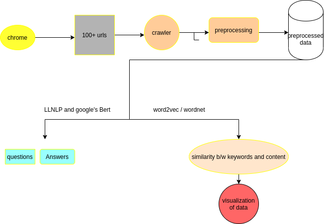

# twimintel

# Contributing
  

### Goal

* Twimintel is a system where a researcher can gather relative information about their query and easily analyze the data.
* Twimintel helps researcher to write best out of best research paper easily without opening the hundreds of tabs.
* Easy visualization of data by graphs.

### Approach

